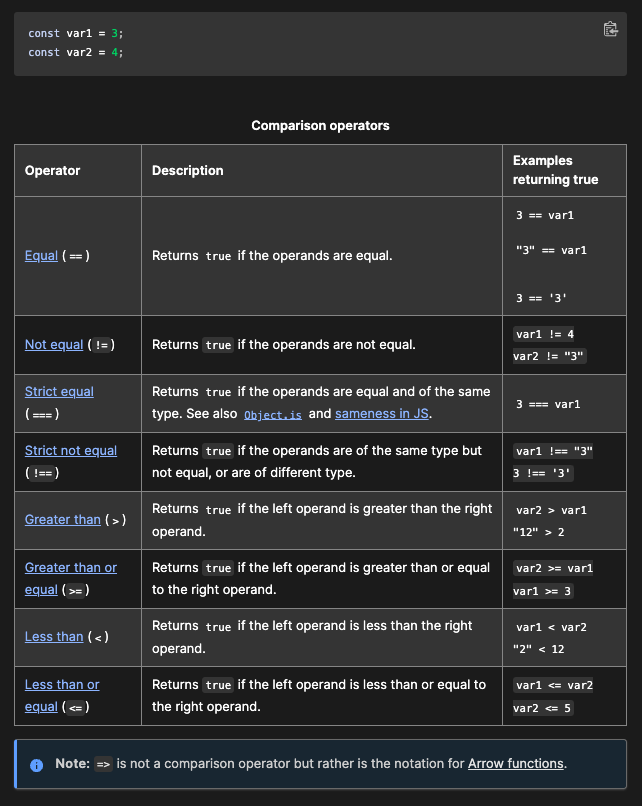

# Class 08: Operators and Loops

## JavaScript cont'd

---
---

### Assignment Operators

An assignment operator assigns a value to its left operand based on the value of its right operand.

*Review: The numbers (in an arithmetic operation) are called operands.
The operation (to be performed between the two operands) is defined by an operator.*

- The simple assignment operator is equal (=), which assigns the value of its right operand to its left operand. That is, x = f() is an assignment expression that assigns the value of f() to x.
- There are also compound assignment operators that are shorthand for the operations (you can find these in the table from the link below).

#### Assigning to properties

- If an expression evaluates to an object, then the left-hand side of an assignment expression may make assignments to properties of that expression.
- If an expression does not evaluate to an object, then assignments to properties of that expression do not assign.
- It is an error to assign values to unmodifiable properties or to properties of an expression without properties (null or undefined).

#### Destructuring

For more complex assignments, the destructuring assignment syntax is a JavaScript expression that makes it possible to extract data from arrays or objects using a syntax that mirrors the construction of array and object literals.

#### Evaluation and Nesting

In general, assignments are used within a variable declaration (i.e., with const, let, or var) or as standalone statements).

By chaining or nesting an assignment expression, its result can itself be assigned to another variable. It can be logged, it can be put inside an array literal or function call, and so on. *Can result in surprising behavior, so it is discouraged but happens occasionally.*

- When chaining these expressions without parentheses or other grouping operators like array literals, the assignment expressions are grouped right to left (they are right-associative), but they are evaluated left to right.
- Note that, for all assignment operators other than = itself, the resulting values are always based on the operands' values before the operation.

#### Avoid assignment chains

Chaining assignments or nesting assignments in other expressions can result in surprising behavior. For this reason, chaining assignments in the same statement is discouraged.

In particular, putting a variable chain in a const, let, or var statement often does not work. **Only the outermost/leftmost variable would get declared**; other variables within the assignment chain are not declared by the const/let/var statement.

---

### Comparison Operators

A comparison operator compares its operands and returns a logical value based on whether the comparison is true.

- Operands can be numerical, string, logical, or object values.
- Strings are compared based on standard lexicographical ordering, using Unicode values.
- If the two operands are not of the same type, JavaScript attempts to convert them to an appropriate type for the comparison. This results in comparing the operands numerically.
- The sole exceptions to type conversion within comparisons involve the === and !== operators, which perform strict equality and inequality comparisons.
- These operators do not attempt to convert the operands to compatible types before checking equality.

---

[Comparison/Assignment Operators with Descriptive Tables](https://developer.mozilla.org/en-US/docs/Web/JavaScript/Guide/Expressions_and_Operators#comparison_operators)



[Loops from MDNwebdocs](https://developer.mozilla.org/en-US/docs/Web/JavaScript/Guide/Loops_and_iteration#for_statement)

---

### Loops- for & while Statements

Loops offer a quick and easy way to do something repeatedly.

- Many different kinds of loops, but they all repeat an action some number of times. (Note that it's possible that number could be zero!)
- The various loop mechanisms offer different ways to determine the start and end points of the loop.
- There are various situations that are more easily served by one type of loop over the others.

---

### 'for' statement

A 'for' statement looks like this-

- for (initialization; condition; afterthought)

  statement

A 'for' loop repeats until a specified condition evaluates to false. The JavaScript for loop is similar to the Java and C for loop.

When a for loop executes, the following occurs:

1. The initializing expression initialization, if any, is executed. This expression usually initializes one or more loop counters, but the syntax allows an expression of any degree of complexity. This expression can also declare variables.
2. The condition expression is evaluated. If the value of condition is true, the loop statements execute. Otherwise, the for loop terminates. (If the condition expression is omitted entirely, the condition is assumed to be true.)
3. The statement executes. To execute multiple statements, use a block statement ({ }) to group those statements.
4. If present, the update expression afterthought is executed.
5. Control returns to Step 2.

#### JavaScript for statement example

Here, the for statement declares the variable i and initializes it to 0. It checks that i is less than the number of options in the < select > element, performs the succeeding if statement, and increments i by 1 after each pass through the loop.

```md

function countSelected(selectObject) {
  let numberSelected = 0;
  for (let i = 0; i < selectObject.options.length; i++) {
    if (selectObject.options[i].selected) {
      numberSelected++;
    }
  }
  return numberSelected;
}

const btn = document.getElementById("btn");

btn.addEventListener("click", () => {
  const musicTypes = document.selectForm.musicTypes;
  console.log(`You have selected ${countSelected(musicTypes)} option(s).`);
});

```

---

#### HTML 'for' statement example

In the example below, the function contains a for statement that counts the number of selected options in a scrolling list (a < select > element that allows multiple selections).

```md

<form name="selectForm">
  <label for="musicTypes"
    >Choose some music types, then click the button below:</label
  >
  <select id="musicTypes" name="musicTypes" multiple>
    <option selected>R&B</option>
    <option>Jazz</option>
    <option>Blues</option>
    <option>New Age</option>
    <option>Classical</option>
    <option>Opera</option>
  </select>
  <button id="btn" type="button">How many are selected?</button>
</form>

```

### 'do...while' statement

The do...while statement repeats until a specified condition evaluates to false.

```md

do
  statement
while (condition);

```

- 'statement' is always executed once before the condition is checked.
- To execute multiple statements, use a block statement ({ }) to group those statements
- If condition is true, the statement executes again.
- At the end of every execution, the condition is checked.
- When the condition is false, execution stops, and control passes to the statement following do...while.

In the following example, the do loop iterates at least once and reiterates until i is no longer less than 5.

```md

let i = 0;
do {
  i += 1;
  console.log(i);
} while (i < 5);

```

---

### 'while' statement

A while statement executes its statements as long as a specified condition evaluates to true.

```md

while (condition)
  statement

```

- If the condition becomes false, statement within the loop stops executing and control passes to the statement following the loop.

- The condition test occurs before statement in the loop is executed. If the condition returns true, statement is executed and the condition is tested again. If the condition returns false, execution stops, and control is passed to the statement following while.

- To execute multiple statements, use a block statement ({ }) to group those statements.
- Avoid infinite loops. Make sure the condition in a loop eventually becomes false—otherwise, the loop will never terminate!

The following while loop iterates as long as n is less than 3:

```md

let n = 0;
let x = 0;
while (n < 3) {
  n++;
  x += n;
}

```

With each iteration, the loop increments n and adds that value to x. Therefore, x and n take on the following values:

- After the first pass: n = 1 and x = 1
- After the second pass: n = 2 and x = 3
- After the third pass: n = 3 and x = 6
- After completing the third pass, the condition n < 3 is no longer true, so the loop terminates.

---
---

## Answer

1. What is an expression in JavaScript?
    An 'expression' is a valid unit of code that resolves to a value. There are 2 types of expressions (one has side affects of assigning values, the other only evaluates).
2. Why would we use a loop in our code?
    Loops are used for repeating code, you would use one so that you don't have to repeatedly add the same code to your html pages.
3. When does a for loop stop executing?
    A for loop won't stop until a specific condition evaluates to false.
4. How many times will a while loop execute?
    A while statement executes its statements as long as a specified condition evaluates to true.

    ---
    ---
